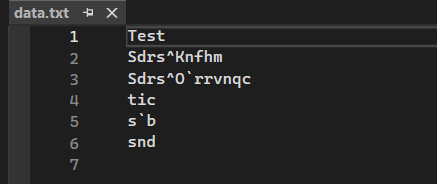
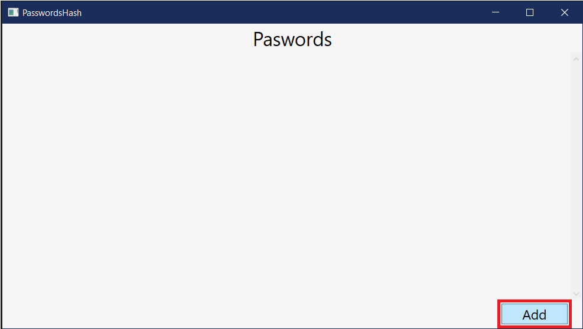
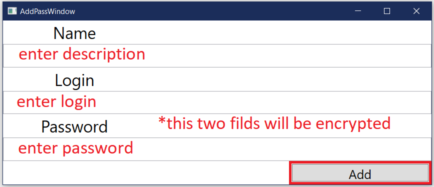
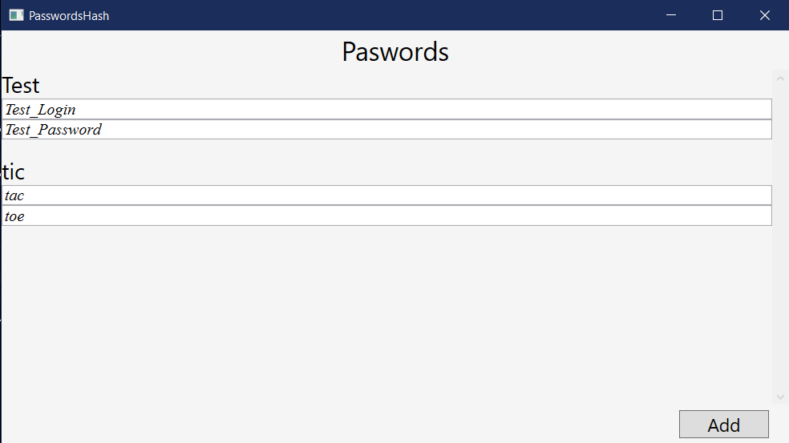
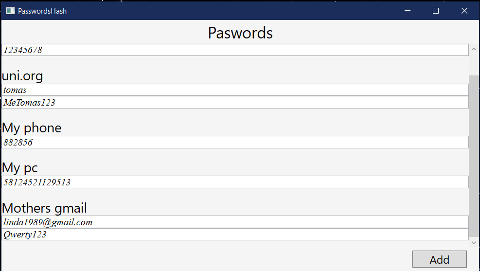

# PasswordsHash
  

**PasswordsHash** - is an application for windows that will allow you to keep your passwords secret

## Encryption

All your passwords are saved in encrypted format:




This method makes all encryption:

```C#
foreach (var item in charArr)
{
    if (!char.IsDigit(item))
    {
        int Unicode = (int) item;
        Unicode--;
        rescchars.Add((char)Unicode);
    }
    else
    {
        rescchars.Add(item);
    }
}
```
You can adjust it for yourself, just don't forget to decode your data in `MainWindow.xaml.cs` file.

## Usage








## Example


